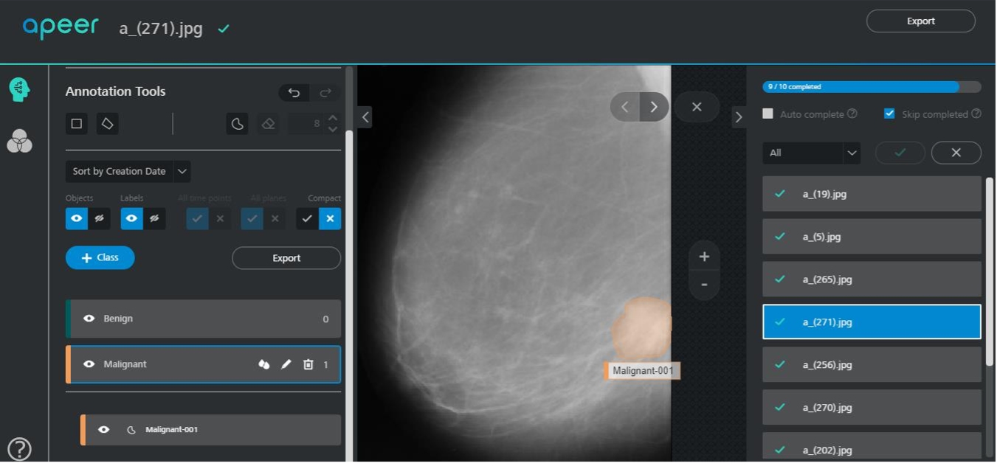
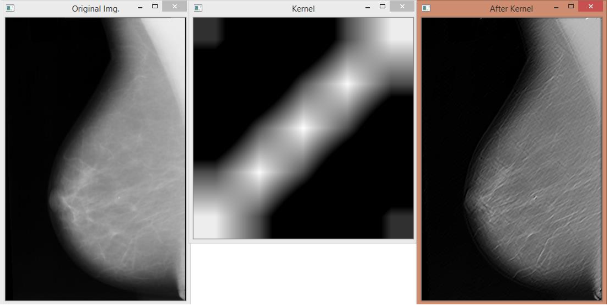
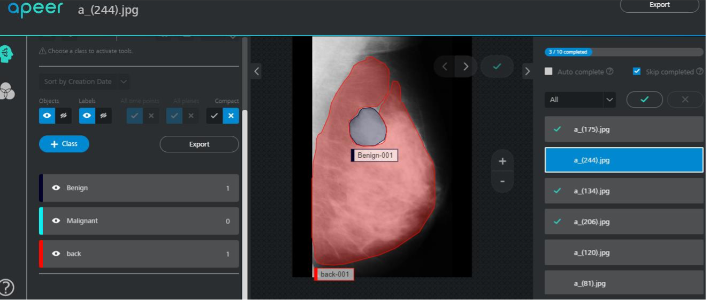
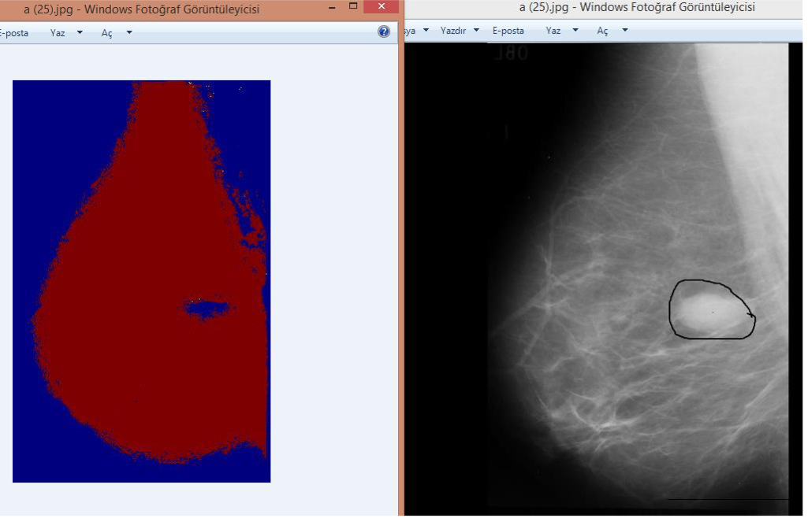

# Textural_Features_Based_Tumor_Segmentation

## About the Project

This project was prepared as my summer internship in the last year of my bachelor in Çukurova University.

Texture is an important feature in the images, it can be used to describe the contents of an image or a region in additional to colour features as colour features are not sufficient to identify the image since different images may have similar histograms.

[MIAS](https://www.repository.cam.ac.uk/items/b6a97f0c-3b9b-40ad-8f18-3d121eef1459) - Mammographic Image Analysis Society Mini Mammographic Database was chosen to work on this topic.
The steps of the project are mainly as follows:

- Taking mammogram images(from MIAS Database) as data and applying some operations on these images. 
- Labeling these images and extracting some textural features from them.
- Making these data ready for the input of machine learning.
- Training a model and make predictions on images.

---
 

## Data Preprocessing and Labeling

Some unnecessary labels were removed and noises on mammogram images were cleaned with OpenCV. Then the abnormality in the images was labeled as _"Benign"(Good Type)_ or _"Malignant"(Bad Type)_ with the website _"APEER"_.

  

---
 

## Feature Extraction

Gabor filters are bandpass filters which are used in image processing for feature extraction, texture analysis etc. When a Gabor filter is applied to an image, it gives the highest response at edges and at points where texture changes.(The effect of an Gabor filter can be seen in the image below.) In OpenCV, `cv2.getGaborKernel(ksize, sigma, theta, lambda, gamma, psi, ktype)` function is used to create a Gabor kernel. 

By changing these parameters inside nested for loops, various gabor filters are obtained. Then, different textural features of the images are obtained by applying these different filters on each image. The obtained data were stored in data frame to be able to use as input in model training part.

Also by applying some other filters, different features such as Edge, Entropy, Mean and Gradient were obtained and they are saved in the same data frame as additional features.

  

---
 

## Model Training

By using Random Forest Classifier with Sckit Learn library, pixel-based classification was done. Each pixel in the image was predicted as Good Type tissue or Bad Type.

### Different Approach

During the labeling process, since only the tumor regions were labeled, most of the mask images consisted of zero value. When the model was trained with these values, the zero value was also taken as a feature. So results contained only the zero value and showed a constant background.

Thus in the new approach, the normal breast tissue was labeled as shown in the image below. So the model could learn, what normal breast tissue is. In this way, areas other than normal tissue can be found as Tumor areas.

  

---
 

An example result can be seen in the below image:

 

  
